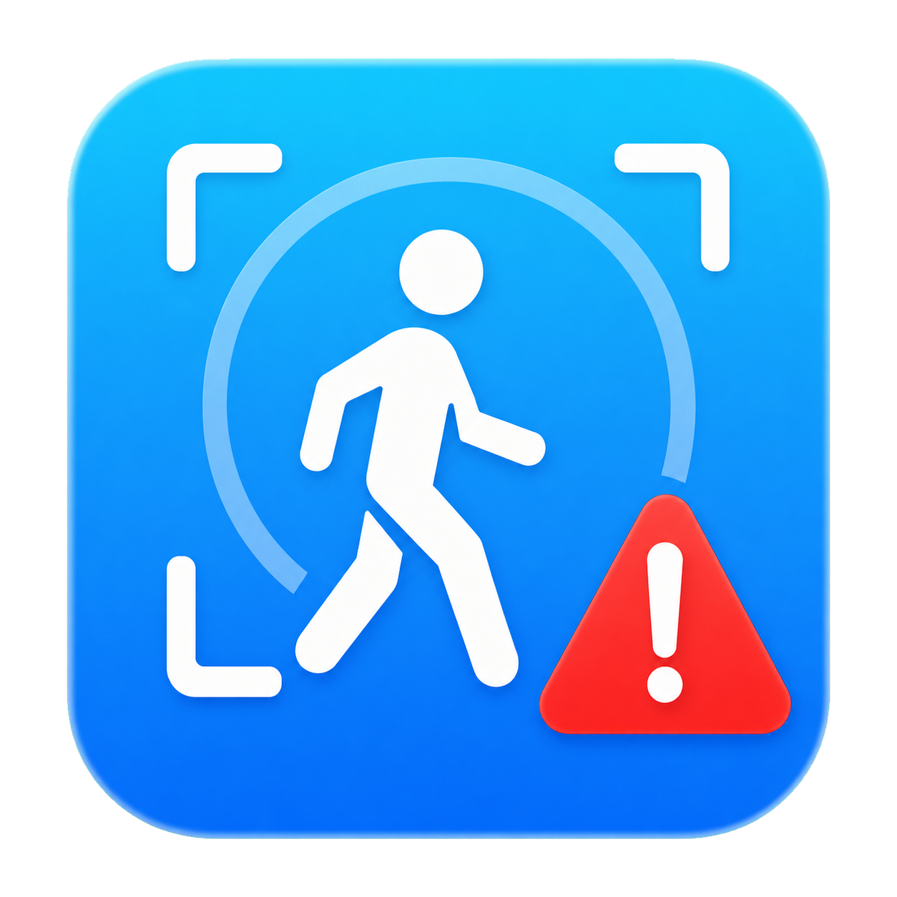

# 🚨 AlertZone Desktop

<div align="center">
    
</div>

<div align="center">
    <p style="font-size: 30px; font-weight: 700; margin: 10px 0 0;">
        AlertZone Desktop
    </p>
    <p>局域网前端 · 后台告警 · 原生弹窗通知</p>
</div>

## 🔍 概述

AlertZone Desktop 是 AlertZone 的独立局域网桌面客户端。界面完全使用
PySide6 原生控件绘制，并直接调用 AlertZone Server 的状态、预览、截图和
重新布防接口。
即使主窗口已经隐藏，程序仍可在检测到报警时显示原生置顶小窗并播放提示音。

该项目主要用于：

- 在另一台局域网电脑上使用原生 AlertZone 监测仪表板
- 关闭主窗口后继续在系统托盘后台接收报警
- 通过独立小窗显示报警信息和触发事件截图
- 自定义报警小窗的位置、尺寸、关闭时间和提示音

> AlertZone Desktop 不打开本地摄像头，也不运行 YOLO 模型。摄像头检测、
> 人物跟踪、事件截图和局域网接口均由 AlertZone Server 提供；Desktop 不加载
> 或依赖 Server 的 `src/web/index.html`。

## ✨ 功能

### 局域网前端

- 首次启动时输入 AlertZone Server 的局域网地址
- 未填写端口时自动使用默认端口 `8765`
- 连接前验证目标地址是否为可识别的 AlertZone Server
- 连接页支持取消地址验证，并可先进入未连接的主页面
- 使用 Desktop 自己绘制的状态、人数、持续时间和 FPS 仪表板
- 直接通过 Server 接口按需显示实时预览
- 自动保存上次连接地址并在下次启动时重新连接
- 断线后持续重试，并在工具栏和系统托盘显示连接状态
- 自动保存连续检测、确认时间、实时预览、弹窗和声音选项

### 后台报警

- 关闭主窗口或点击“后台运行”后驻留系统托盘
- macOS 进入后台运行时隐藏 Dock 栏图标，恢复主窗口时重新显示
- 主页功能区提供“启用告警”开关
- 主界面打开时，告警内容直接显示在主页面；人数以小标签叠加在画面内，
  画面下方只显示“警告”，鼠标移入画面中央后显示“退出告警”按钮
- 只有启用告警且主窗口最小化或进入后台时，报警小窗才会生效
- 后台持续轮询报警事件，不依赖主窗口是否显示
- 报警时只显示置顶小窗，不自动弹出主界面
- 在报警小窗中显示人数、触发时间和事件截图
- 主页功能区提供“连续监测”开关，退出告警后可自动重新布防
- “告警设置”提供五种告警显示方式：放大人物、实时预览、全屏红色且放大人物、
  全屏红色且实时预览、仅提示音提醒；小窗会跟随所选风格和连续监测状态
- 选择“仅提示音提醒”时只播放当前提示音，不显示主页面告警画面或后台告警小窗
- 选择“仅提示音提醒”时自动禁用主页“弹窗位置”按钮
- 可开启“连续告警显示”：人员仍在时保持小窗，人员离开后再按告警退出时长关闭
- 首次连接时忽略历史事件，避免把旧报警误认为新报警
- 支持按自动退出告警时长关闭小窗，并连续重新布防
- 可设置退出告警后等待 `5`、`10`、`20`、`30`、`60` 秒或自定义时间再重新监测
- 等待再次监测独立于“连续监测”开关；设置了等待时间后，两种状态都会在等待结束时重新布防

### 弹窗与提示音

- 可通过模拟小窗设置报警弹窗的位置和大小
- 自动记忆确认后的弹窗位置与尺寸
- 内置 `audio/audio.mp3` 软件默认提示音
- 支持电脑默认提示音
- 支持 WAV、MP3、M4A、AAC、FLAC 和 OGG 等自定义音频
- 支持调整自定义声音音量和试听

### 界面主题

- 首次启动默认跟随操作系统主题，并保存之后选择的主题模式
- 主页按钮按“浅色主题 → 深色主题 → 跟随系统”循环切换
- “跟随系统”模式会在程序运行期间实时响应系统外观变化
- 主窗口、连接页、设置页、工具栏和报警小窗统一适配主题
- 原生布局自动适应桌面窗口尺寸，避免文字挤压和遮挡

## 📦 安装

### 系统要求

- **操作系统**：Windows 或 macOS
- **Python**：推荐 Python 3.11 或 3.12
- **网络**：与 AlertZone Server 处于同一局域网
- **前置程序**：一台已经启动局域网服务的 AlertZone Server

### 1. 创建虚拟环境

使用 Conda：

```bash
conda create -n AlertZone-Desktop python=3.12
conda activate AlertZone-Desktop
```

或使用 Python 自带的 `venv`。

macOS / Linux：

```bash
python3 -m venv .venv
source .venv/bin/activate
```

Windows PowerShell：

```powershell
py -m venv .venv
.\.venv\Scripts\Activate.ps1
```

### 2. 安装依赖

```bash
python -m pip install --upgrade pip
python -m pip install -r requirements.txt
```

Desktop 只依赖 PySide6，不需要安装 PyTorch、Ultralytics 或 OpenCV。

### 3. 启动程序

请在 `AlertZone Desktop` 目录中运行：

```bash
python start.py
```

## 🏗️ 打包发布

Desktop 使用 PyInstaller 生成独立应用。PyInstaller 不支持跨平台打包：
Windows 安装包必须在 Windows 上构建，macOS 应用必须在 macOS 上构建。
当前发布版本为 **1.2.2**。`build.py` 会将该版本写入 Windows 可执行文件版本资源，
以及 macOS 的 `CFBundleShortVersionString` 和 `CFBundleVersion`。

### 1. 安装打包依赖

进入 `AlertZone Desktop` 目录并激活虚拟环境，然后运行：

```bash
python -m pip install --upgrade pip
python -m pip install -r requirements-build.txt
```

### 2. 构建目录版本

```bash
python build.py
```

在 Windows 中直接运行该命令时，会显示打包格式选择：

```text
1. 单文件格式
2. 文件夹格式（推荐）
```

也可以跳过交互菜单，直接指定文件夹格式：

```bash
python build.py --onedir
```

默认使用无控制台窗口的 GUI 模式，并自动完成以下配置：

- 使用 `start.py` 作为程序入口
- 收集 PySide6 和 Qt Multimedia 运行组件
- 将 `icon/` 资源加入应用
- 将 `audio/audio.mp3` 软件默认提示音加入应用
- Windows 使用 `icon.ico`
- macOS 使用 `icon.icns`
- 写入应用版本 `1.2.2`
- 清理上一次 PyInstaller 构建缓存

构建产物位于：

- **Windows**：`dist/AlertZone Desktop/AlertZone Desktop.exe`
- **macOS**：`dist/AlertZone Desktop.app`
- **Linux**：`dist/AlertZone Desktop/AlertZone Desktop`

目录版本启动更快，推荐用于正常发布。发布时需要复制整个产物目录；macOS
只需复制完整的 `.app`。

### 3. 构建单文件版本

```bash
python build.py --onefile
```

单文件版本便于传输，但首次启动需要释放 Qt 组件，速度通常比目录版本慢。

### 4. 打包故障排查

如果打包后的程序无法启动，可临时保留控制台查看错误：

```bash
python build.py --console
```

建议打包前先验证源码和测试：

```bash
python start.py
python -m unittest discover -s tests -v
```

macOS 构建结果默认没有开发者签名和公证；对外分发时需要使用 Apple Developer
证书完成签名、公证和 stapling。Windows 未签名程序也可能触发 SmartScreen，
正式分发时建议使用代码签名证书。

## 🚀 使用说明

### 连接 AlertZone Server

1. 启动 AlertZone Server。
2. 在 Server 中启用“局域网连接”。
3. 记录 Server 左下角显示的局域网地址，例如：

   ```text
   http://192.168.1.20:8765
   ```

4. 启动 AlertZone Desktop，并在连接页输入该地址。
5. 连接成功后即可在 Desktop 中使用监测页面；点击“取消”可停止地址验证并先进入
   未连接的主页面，之后仍可通过“更换地址”重新连接。

只填写 `192.168.1.20` 时，Desktop 会自动补全为
`http://192.168.1.20:8765`。

### 后台运行

点击工具栏“后台运行”或直接关闭主窗口后，程序会驻留系统托盘。开启主页的
“启用告警”后，报警小窗会在窗口最小化或后台运行期间读取报警事件。通过托盘菜单
可以：

- 打开主界面
- 查看当前连接状态
- 打开告警设置或其他配置
- 完全退出程序

点击窗口关闭按钮时，Desktop 会与 Server 一样提示选择：

- **后台静默运行**：隐藏主窗口；“启用告警”开启时显示后台报警
- **退出应用程序**：完全结束 Desktop
- **取消**：返回主窗口，不执行关闭操作

右键任务栏/托盘图标可直接勾选或取消“启用告警”，该状态与主页按钮双向同步。
左键单击任务栏/托盘图标会直接恢复主窗口，不弹出菜单；只有右键单击才显示托盘菜单。
macOS 使用系统原生 Cocoa `NSStatusItem` 和 `NSMenu`，不是 Qt 模拟菜单；安装依赖时会
按平台自动安装 `pyobjc-framework-Cocoa`，打包脚本也会自动收集所需原生模块。

### 主页设置按钮

- **启用告警**：允许报警小窗在主窗口最小化或后台运行时生效
- **连续监测**：开启后，报警小窗退出告警时会重新布防
- **告警设置**：设置告警显示、确认时间、自动退出告警时长、等待再次监测和提示音；
  告警触发时间和退出时长均支持自定义秒数；自动退出提供立即（0 秒）、2、5、
  10、15 秒及无限等待选项；等待再次监测支持不设置、
  5、10、20、30、60 秒和自定义时间，选择“自定义”后会在右侧展开秒数输入框；
  提示音与告警共用同一生命周期：触发确认后才播放，退出告警时停止，等待重新
  布防期间不会重复播放；开启“持续跟随显示”后，人员离开前只提示一次声音；
  “仅提示音提醒”则以声音本身作为告警；
  设置等待时间后，无论“连续监测”是否开启都会在等待结束时重新布防
- **弹窗位置**：打开模拟报警小窗，直接调整并保存位置和大小
- **其他配置**：打开预留的二级菜单，目前暂无可配置项
- **第一排主题按钮**：在浅色、深色和跟随系统三种主题模式间循环切换

### 设置报警小窗

1. 在主页点击“弹窗位置”。
2. Desktop 会显示一个模拟报警小窗。
3. 拖动标题栏调整位置。
4. 拖动窗口边缘调整大小。
5. 点击“确定位置和大小”保存。

真实报警会使用相同的位置和尺寸显示，不会同时唤醒主界面。
主窗口不设置固定最小尺寸；启动时按按钮单行完整显示所需的宽度打开。用户缩窄
窗口后，顶部状态栏会自动换行；需要两行排列时，主页功能按钮区域默认整体隐藏，
鼠标移入最上方连接状态栏后展开全部两行按钮，离开顶部栏和按钮区域后自动收起。

### 设置提示音

在主页点击“告警设置”，可选择软件默认提示音、电脑默认提示音、自定义声音文件
或“关闭提示音”。软件默认提示音使用项目内置的 `audio/audio.mp3`，打包时会自动
包含该文件。
关闭后报警小窗仍会正常显示，但不会播放声音。自定义音频的格式支持情况取决于
操作系统的 Qt 多媒体后端，WAV 文件通常具有最好的兼容性。

### 设置主题

Desktop 首次启动时默认跟随 Windows 或 macOS 的系统外观。主页第一排主题按钮
会按“浅色主题 → 深色主题 → 跟随系统”循环切换并保存选择；使用“跟随系统”时，
系统外观在程序运行期间发生变化，Desktop 也会立即同步。主题不放在设置窗口中。

## 🛠️ 开发与构建

### 项目文件

- `src/AlertZone_Desktop.py`：原生仪表板、接口轮询、实时预览、报警弹窗和主题
- `src/dev_preview.py`：开发阶段保存代码后自动重启界面的预览脚本
- `start.py`：项目根目录启动入口
- `build.py`：Windows、macOS 和 Linux 的 PyInstaller 打包入口
- `icon/`：Desktop 蓝色主题的 Windows、macOS 和运行时图标
- `audio/audio.mp3`：软件默认告警提示音
- `requirements.txt`：Desktop 运行依赖
- `requirements-build.txt`：运行依赖和 PyInstaller 打包依赖
- `tests/test_url.py`：局域网地址规范化测试
- `tests/test_monitor.py`：后台报警事件轮询测试
- `tests/test_00_dashboard.py`：原生状态仪表板和预览接口测试

### 源码调试

主程序入口：

```bash
python start.py
```

自动刷新预览：

```bash
python src/dev_preview.py
```

运行后会监听 `src` 目录中的 Python 文件。保存源码时 Desktop 界面会自动关闭并
重新启动，按 `Ctrl+C` 可结束预览。

运行测试：

```bash
python -m unittest discover -s tests -v
```

项目使用的核心组件：

- [PySide6](https://doc.qt.io/qtforpython-6/)：桌面界面及 Windows/Linux 系统托盘
- [PyObjC Cocoa](https://pyobjc.readthedocs.io/)：macOS 原生状态栏与原生菜单
- [Qt Network](https://doc.qt.io/qtforpython-6/PySide6/QtNetwork/index.html)：连接验证和后台状态轮询
- [Qt Multimedia](https://doc.qt.io/qtforpython-6/PySide6/QtMultimedia/index.html)：自定义报警声音播放

### 与 Server 的关系

Desktop 只调用 Server 提供的接口，不读取 Server 的 Web 页面。使用的主要接口：

- `/api/status`：检测状态、人数、FPS、持续时间和报警事件
- `/api/preview.jpg`：按需获取实时检测画面
- `/api/intruder.jpg`：获取指定报警事件截图
- `/api/rearm-alert`：设置确认时间并重新布防

两者职责如下：

- **AlertZone Server**：摄像头、YOLO、ByteTrack、区域检测、截图和 HTTP 接口
- **AlertZone Desktop**：原生局域网前端、实时预览、后台报警小窗和桌面提示音

返回 [AlertZone 项目总览](../README.md)。
